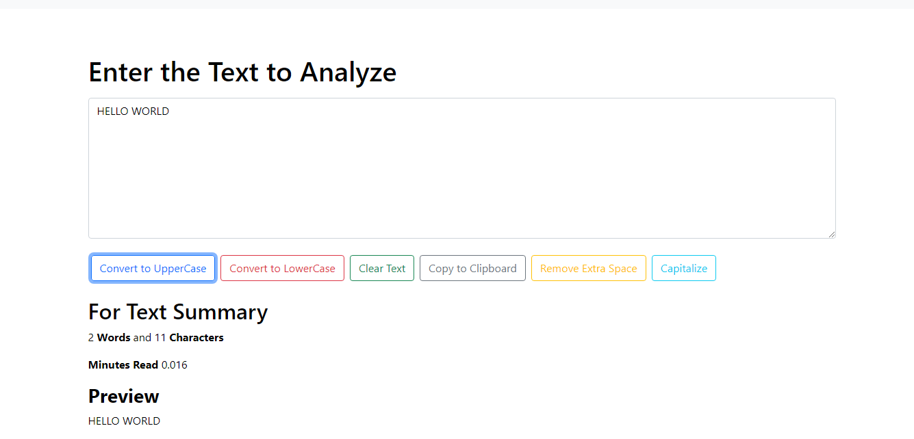

# TEXTUTILS App

### _Web Application using ReactJs_

### Learned from : [Code With Harry](https://youtube.com/playlist?list=PLu0W_9lII9agx66oZnT6IyhcMIbUMNMdt)

## Images

### Light Mode

### Dark Mode

## Mobile Responsive

## Run Locally

- Run this command to git clone.

         https://github.com/aliaftabsheikh/TextUtils-Reactapp.git

- You are now in the dev environment and you can play around

## Technologies Use

- HTML5
- CSS3
- Bootstrap
- React js (Frontend)
